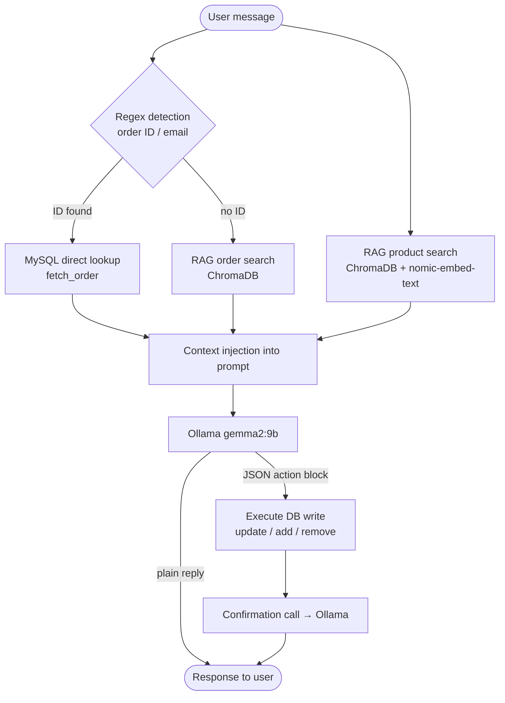

# Mango Bot

An AI-powered webshop assistant for Clickshop, built with FastAPI and Ollama. Demonstrates **local LLM integration**, a **RAG pipeline** (ChromaDB + nomic-embed-text), **async Python** throughout, **tool calling via a JSON action protocol**, and **real MySQL database connectivity** — all without any external AI API calls.

## Features

- **Product search** — searches the product catalogue by keyword on every message; injects matching results as context for the LLM
- **Order lookup** — detects order IDs in user messages and fetches order details (status, delivery address, products)
- **Address update** — guides the customer through providing all required fields, then updates the delivery address in the database
- **Order product management** — adds or removes products from an existing order on customer request
- **Action protocol** — the LLM emits a structured JSON block to trigger DB writes; the bot confirms the result in Serbian before responding
- **Data pipeline** — collects product and text data from the DB and local files, cleans it, and exports JSONL for fine-tuning

## Architecture



## Tech stack

- [FastAPI](https://fastapi.tiangolo.com/) — async REST API
- [Ollama](https://ollama.com/) — local LLM inference (gemma2:9b)
- [ChromaDB](https://www.trychroma.com/) — local vector store for product and order embeddings
- [nomic-embed-text](https://ollama.com/library/nomic-embed-text) — local embedding model via Ollama
- [aiomysql](https://github.com/aio-libs/aiomysql) — async MySQL driver
- [Pydantic / pydantic-settings](https://docs.pydantic.dev/) — request models and settings from `.env`
- [httpx](https://www.python-httpx.org/) — async HTTP client for Ollama calls

## Requirements

- Python 3.8+
- MySQL database (`clickshop` schema)
- [Ollama](https://ollama.com/) running locally

## Local setup

**1. Install dependencies**

```bash
pip install -r requirements.txt
```

**2. Create a `.env` file**

```env
OLLAMA_BASE_URL=http://localhost:11434
OLLAMA_MODEL=mistral:7b
MAX_HISTORY_TURNS=20

MYSQL_HOST=localhost
MYSQL_PORT=3306
MYSQL_USER=root
MYSQL_PASSWORD=yourpassword
MYSQL_DATABASE=clickshop
```

**3. Pull the model**

```bash
ollama pull mistral:7b
```

**4. Start the server**

```bash
uvicorn app.main:app --reload
```

The chat UI is available at `http://localhost:8000`.

## Data pipeline

The pipeline collects records from the MySQL `product` table and any `.txt` / `.json` files in the `data/` directory, deduplicates and cleans them, and exports prompt–completion pairs as JSONL for fine-tuning.

```bash
python -m pipeline.run
```

Options:

```
--output PATH      Output JSONL file (default: training_data.jsonl)
--data-dir PATH    Source file directory (default: data/)
```

